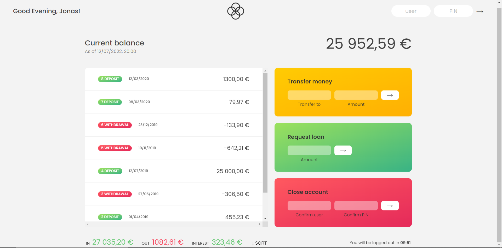

# Bankist App
### Online transaction app

## Table of Contents
-   [Overview](#overview)
    -   [Screenshot](#screenshot)
    -   [The challenge](#the-challenge)
-   [My Process](#my-process)
    -   [Built With](#built-with)
    -   [What I Learned](#what-i-learned)
-   [Author](#author)

## Overview

### Screenshot

### The challenge
User should be able to:
-   Send a money to other person
-   Request a loan from bank
-   View the summary of transaction in minimal UI
-   Currency updation on country change
-   Sort the transaction
-   View total credited amount
-   View total debited amount
-   View interest amount on requested loan

## My Process

### Built with
